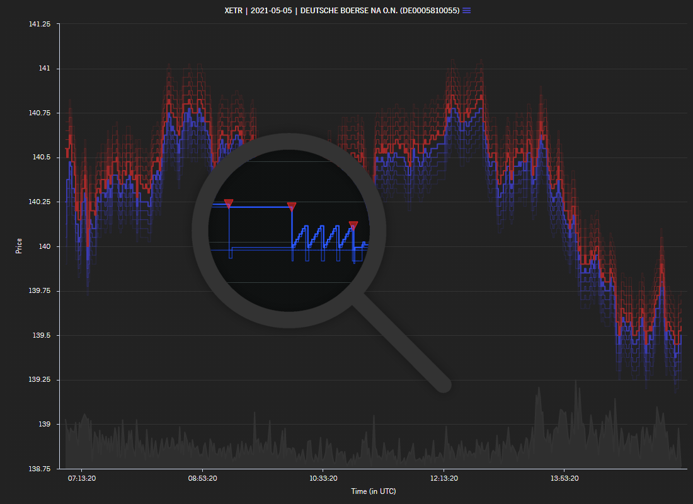

# [A7® Analytics Platform](https://a7.deutsche-boerse.com/)

### Ad hoc insights from high precision market data

* The A7 Analytics online platform offers the unique combination of co-location quality Eurex and Xetra data and computational power within an easy-to-use framework.
* A7 gives ad-hoc access to advanced analytics based on most granular market data.
* A7 provides cost efficient and scalable solutions reducing the development cycles in order to focus on true value add.
* The A7 platform can be used to maximize trading efficiency, improve alpha generation, and for developing and back-testing execution algorithms.

### Use cases
01. Retrieving orderbook data: [HTML](https://deutsche-boerse.github.io/a7/usecases/01_simple_example.html) | [Notebook](/usecases/01_simple_example.ipynb)
01. Using reference data:  [HTML](https://deutsche-boerse.github.io/a7/usecases/02_simple_rdi.html) | [Notebook](/usecases/02_simple_rdi.ipynb)
01. Empirical analysis of cash rates benchmark hedging: [HTML](https://deutsche-boerse.github.io/a7/usecases/03_cash_rates_benchmark_hedging.html) | [Notebook](/usecases/03_cash_rates_benchmark_hedging.ipynb)

### Visit us
* [A7 Analytics Platform](https://a7.deutsche-boerse.com/)
* [A7 on Deutsche Börse Group Webpage](https://www.mds.deutsche-boerse.com/mds-en/data-services/analytics/A7-analytics-platform)
* [Deutsche Börse Datashop](https://datashop.deutsche-boerse.com/)

### Further information
* [A7 Analytics Platform product sheet](https://www.mds.deutsche-boerse.com/resource/blob/2082122/bf23536b59a555cc1f7d11c314874363/data/en_a7-analytics-platform.pdf)
* [User manual](https://a7.deutsche-boerse.com/doc/A7_GUI_User_Manual_v.1.00.pdf)
* [API Documentation](https://a7.deutsche-boerse.com/doc/api/prod/PROD_API.Documentation.zip)

### Media
* [New A7 platform offers "analytics as a service"](https://www.mds.deutsche-boerse.com/mds-en/about-us/news-highlights/New-A7-platform-offers-analytics-as-a-service--2108634)
* [Get to know A7](https://www.mds.deutsche-boerse.com/mds-en/about-us/news-highlights/Get-to-know-A7-2214922)

### Contact
#### Data Services Sales
[analytics@deutsche-boerse.com](mailto:analytics@deutsche-boerse.com)  
www.mds.deutsche-boerse.com

#### Customer Service
[hdp@deutsche-boerse.com](mailto:hdp@deutsche-boerse.com)  
Tel.: +49-(0) 69-2 11-11 0 33  
8:00 - 18:00 CET

#### Disclaimer

By downloading content from the Deutsche Börse Group Github repository, you declare to Deutsche Börse AG, Mergenthalerallee 61, 65760 Eschborn, Germany, that you, and if you are acting for an organization you and such organization, understand and agree to the following:
The content of this repository is provided to you by Deutsche Börse AG for illustrative purposes only.  It is provided “as” is without any express or implied guarantee or warranty of any kind, including without limitations any representations and warranties as to quality, absence of errors, timeliness or completeness.
As the content is provided to you for free, Deutsche Börse shall not be liable for the content, except for its willful misconduct (“Vorsatz”) and gross negligence (“grobe Fahrlässigkeit”). This Disclaimer is governed by German Law.